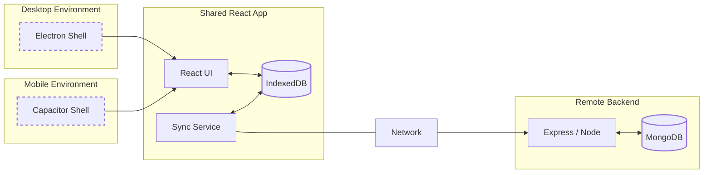

# Onda 🌊

[](https://sonarcloud.io/summary/new_code?id=OleksandrHridzhak_Onda)
[](https://sonarcloud.io/summary/new_code?id=OleksandrHridzhak_Onda)
[](https://sonarcloud.io/summary/new_code?id=OleksandrHridzhak_Onda)
[](https://sonarcloud.io/summary/new_code?id=OleksandrHridzhak_Onda)
### Tech stack
[](https://skillicons.dev)
### Avaliable platforms


<div style="display: flex; gap: 10px; flex-wrap: wrap;">
  
  
</div>

| Resource &nbsp;&nbsp;&nbsp;&nbsp;&nbsp;&nbsp;&nbsp;&nbsp;&nbsp;&nbsp;&nbsp;&nbsp;&nbsp;&nbsp;&nbsp;&nbsp;&nbsp;&nbsp;&nbsp;&nbsp;&nbsp;&nbsp;&nbsp;&nbsp;&nbsp;&nbsp;&nbsp;&nbsp;&nbsp;&nbsp;&nbsp;&nbsp;&nbsp;&nbsp;&nbsp;&nbsp;&nbsp;&nbsp;&nbsp;&nbsp;&nbsp;&nbsp;&nbsp;&nbsp;&nbsp;&nbsp;&nbsp; | Version | Link &nbsp;&nbsp;&nbsp;&nbsp;&nbsp;&nbsp;&nbsp;&nbsp;&nbsp;&nbsp;&nbsp;&nbsp;&nbsp;&nbsp;&nbsp;&nbsp;&nbsp;&nbsp;&nbsp;&nbsp;&nbsp;&nbsp;&nbsp;&nbsp;&nbsp;&nbsp;&nbsp;&nbsp;&nbsp;&nbsp;&nbsp;&nbsp;&nbsp;&nbsp;&nbsp;&nbsp;&nbsp;&nbsp;&nbsp;&nbsp; |
| :-------------------------------------------------------------------------------------------------------------------------------------------------------------------------------------------------------------------------------------------------------------------------------------------------- | :-----: | :---------------------------------------------------------------------------------------------------------------------------------------------------------------------------------------------------------------------------------------------------- |
| **Onda - Windows**                                                                                                                                                                                                                                                                                  |   2.1   | [Download on Gumroad](https://davibes.gumroad.com/l/onda)                                                                                                                                                                                             |

---

```text
📦 Onda
 ├─ 📁 api           # client APIs / services
 ├─ 📁 docs          # documentation (diagrams & design)
 ├─ 📁 mobile        # Capacitor / mobile-specific logic
 ├─ 📁 render        # React frontend
 ├─ 📁 sync-server   # Express sync backend
 ├─ 📄 main.js       # Electron entry point (desktop shell)
 ├─ 📄 preload.js    # Electron preload script

```



## Getting Started

Instructions for how to run the project locally.

### Requirements

- Node.js (version XX+)
- npm or yarn
- Git Bash (for Windows)
- VS Code (optional)

---

## Installation

1. Clone the repository:

```bash
git clone https://github.com/OleksandrHridzhak/Onda
cd Onda
```

2. Install dependencies in the root folder:

```bash
npm install
```

3. Install frontend dependencies:

```bash
cd /render
npm install
cd ../
```

4. Run the start script:

```bash
npm run start
```

---

## Mobile Development (Android)

Onda supports mobile deployment via Capacitor for Android.

### Requirements for Mobile Development

- Android Studio (with SDK and emulator)
- Java JDK 17+
- Android SDK (API level 22+)
- USB debugging enabled on device (for testing on physical device)

### Mobile Commands

All mobile commands should be run from the `render` directory:

```bash
cd render
```

#### Development Mode

Run the app on an Android emulator or connected device:

```bash
npm run mobile:dev
```

This command:

1. Builds the React app
2. Syncs with Capacitor
3. Opens the app on an Android emulator or connected device

#### Build APK

Generate a debug APK file:

```bash
npm run mobile:build
```

The APK will be located at:
`render/android/app/build/outputs/apk/debug/app-debug.apk`

#### USB Testing

Test on a specific device connected via USB:

```bash
npm run mobile:usb
```

This will show a list of connected devices and let you select which one to deploy to.

### Syncing Changes

After making changes to the web app, sync them to the Android project:

```bash
npm run cap:sync
```

---
