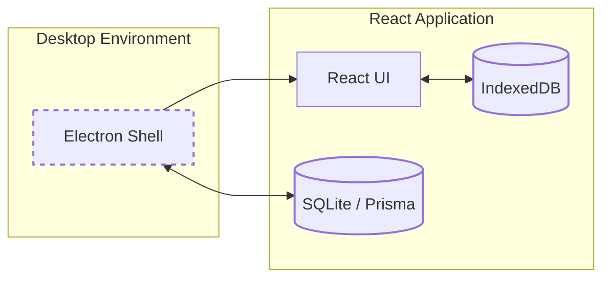

# Onda 🌊

[](https://sonarcloud.io/summary/new_code?id=OleksandrHridzhak_Onda)
[](https://sonarcloud.io/summary/new_code?id=OleksandrHridzhak_Onda)
[](https://sonarcloud.io/summary/new_code?id=OleksandrHridzhak_Onda)
[](https://sonarcloud.io/summary/new_code?id=OleksandrHridzhak_Onda)

### Tech stack

[](https://skillicons.dev)

### Available platforms


<div style="display: flex; gap: 10px; flex-wrap: wrap;">
  
  
</div>


| Resource &nbsp;&nbsp;&nbsp;&nbsp;&nbsp;&nbsp;&nbsp;&nbsp;&nbsp;&nbsp;&nbsp;&nbsp;&nbsp;&nbsp;&nbsp;&nbsp;&nbsp;&nbsp;&nbsp;&nbsp;&nbsp;&nbsp;&nbsp;&nbsp;&nbsp;&nbsp;&nbsp;&nbsp;&nbsp;&nbsp;&nbsp;&nbsp;&nbsp;&nbsp;&nbsp;&nbsp;&nbsp;&nbsp;&nbsp;&nbsp;&nbsp;&nbsp;&nbsp;&nbsp;&nbsp;&nbsp;&nbsp; | Version | Link &nbsp;&nbsp;&nbsp;&nbsp;&nbsp;&nbsp;&nbsp;&nbsp;&nbsp;&nbsp;&nbsp;&nbsp;&nbsp;&nbsp;&nbsp;&nbsp;&nbsp;&nbsp;&nbsp;&nbsp;&nbsp;&nbsp;&nbsp;&nbsp;&nbsp;&nbsp;&nbsp;&nbsp;&nbsp;&nbsp;&nbsp;&nbsp;&nbsp;&nbsp;&nbsp;&nbsp;&nbsp;&nbsp;&nbsp;&nbsp; |
| :-------------------------------------------------------------------------------------------------------------------------------------------------------------------------------------------------------------------------------------------------------------------------------------------------- | :-----: | :---------------------------------------------------------------------------------------------------------------------------------------------------------------------------------------------------------------------------------------------------- |
| **Onda - Windows**                                                                                                                                                                                                                                                                                  |   2.1   | [Download on Gumroad](https://davibes.gumroad.com/l/onda)                                                                                                                                                                                             |

---

```text
📦 Onda
 ├─ 📁 apps
 │   ├─ 📁 desktop    # Electron desktop shell
 │   └─ 📁 render     # React frontend UI
 ├─ 📁 packages
 │   └─ 📁 shared     # Shared types, assets & logic
 └─ 📁 docs         # Documentation & diagrams
```


```mermaid
graph LR
    classDef host stroke-width:2px,stroke-dasharray: 5 5;
    classDef storage stroke-width:2px;

    subgraph ElectronHost [Desktop Environment]
        Electron[Electron Shell]
    end

    subgraph ClientSide [React Application]
        ReactUI[React UI]
        IDB[(IndexedDB)]
        SQLite[(SQLite / Prisma)]
    end

    Electron --> ReactUI
    ReactUI <--> IDB
    Electron <--> SQLite

    class Electron host;
    class IDB,SQLite storage;
```

## Getting Started

Instructions for how to run the project locally.

### Requirements

- Node.js (v20+)
- npm or yarn
- Git Bash (for Windows)
- VS Code (optional)

---

## Installation

1. Clone the repository:

```bash
git clone https://github.com/OleksandrHridzhak/Onda
cd Onda
```

2. Install dependencies in the root folder:

```bash
npm install
```

3. Run the application:

```bash
npm run start
```

---

## 📄 License

This project is licensed under the MIT License - see the [LICENSE](.github/LICENSE) file for details.
