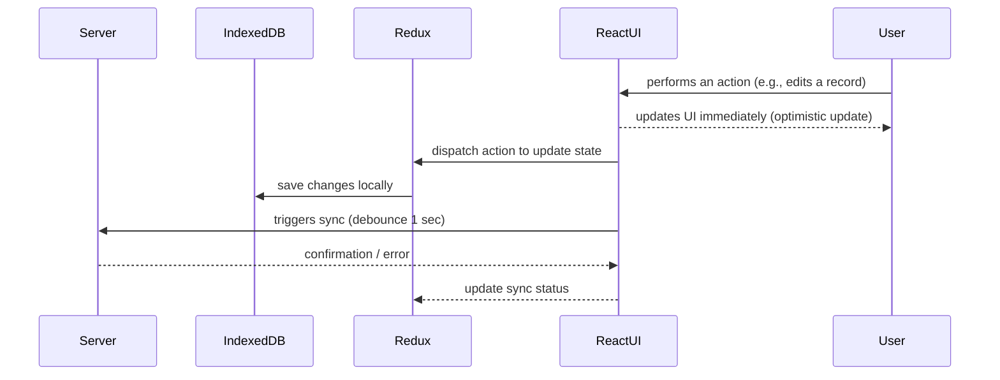

```mermaid
graph LR
    %% Платформи (Окремі хоÑти)
    subgraph ElectronHost [Electron / Desktop]
        Electron[Electron Shell]
    end

    subgraph MobileHost [Capacitor / Mobile]
        Capacitor[Capacitor Shell]
    end

    %% Спільний фронтенд
    subgraph ClientSide [Shared React App]
        ReactUI[React UI]
        Redux[(Redux State)]
        SyncService[Sync Service]
        IDB[(IndexedDB)]
    end

    %% Сервер
    subgraph ServerSide [Remote Backend]
        Express[Express / Node]
        DB[(MongoDB)]
    end

    %% Зв'Ñзки
    Electron --> ReactUI
    Capacitor --> ReactUI
    
    ReactUI <--> Redux
    Redux <--> SyncService
    SyncService <--> IDB
    SyncService <--> Express
    Express <--> DB
```

```text

📦 Onda
 ├─ 📁 api                 # client APIs / services
 ├─ 📁 assets              # icons, images, and other static assets
 ├─ 📁 docs                # documentation (diagrams & design)
 ├─ 📁 mobile              # Capacitor / mobile-specific logic
 ├─ 📁 render              # React frontend
 │    ├─ 📁 components
 │    ├─ 📁 pages
 │    ├─ 📁 styles
 │    └─ ...
 ├─ 📁 sync-server         # Express sync backend
 ├─ 📄 main.js             # Electron entry point (desktop shell)
 ├─ 📄 preload.js          # Electron preload script
 ├─ 📄 webpack.config.js   # frontend bundler configuration
 └─ 📄 package.json        # dependencies and scripts
```

📦 ReportLab
 ├─ 📁 api           # client APIs / services
 ├─ 📁 assets        # icons, images, and other static assets
 ├─ 📁 docs          # documentation (diagrams & design)
 ├─ 📁 render        # React frontend
 ├─ 📄 main.js       # Electron entry point (desktop shell)
 ├─ 📄 preload.js    # Electron preload script
 └─ 📄 package.json  # Dependencies and scripts


## Детальний Data Flow

### 1. Структура сервісу синхронізації

```
┌─────────────────────────────────────────────────────────────────┐
│                      SyncService (Orchestrator)                 │
│                                                                  │
│  ┌──────────────────┐  ┌──────────────────┐  ┌──────────────┐  │
│  │ SyncConfigMgr    │  │ SyncOperations   │  │ SyncStateMgr │  │
│  │ ─────────────    │  │ ──────────────   │  │ ────────────  │  │
│  │ • Зчит/запис     │  │ • Push to Server │  │ • Version    │  │
│  │   конфігу IndexDB│  │ • Pull from Srv  │  │ • Timers     │  │
│  │ • Валідація      │  │ • Test connect   │  │ • Flags      │  │
│  │ • Server URL,    │  │ • Merge data     │  │ • Secret key │  │
│  │   Secret key     │  │                  │  │              │  │
│  └──────────────────┘  └──────────────────┘  └──────────────┘  │
└─────────────────────────────────────────────────────────────────┘
```

### 2. Local-First Data Flow

```
User Action
    ↓
React Component dispatchuje Redux Action
    ↓
PersistMiddleware перехоплює action
    ↓
Дані одразу зберігаються в IndexedDB
    ↓
Redux State оновлюється
    ↓
React re-renders UI (optimistic)
    ↓
notifyDataChange() запускає debounce таймер (1 сек)
    ↓
Після 1 сек: syncService.sync() намагається синхронізувати з сервером
```

### 3. Sync Цикл (Auto-Sync кожні 5 хвилин)

```
syncService.initialize()
    ↓
Встановлює auto-sync таймер (5 хвилин)
    ↓
⏰ Кожні 5 хвилин або при ручному виклику:
    │
    ├─→ Check config (enabled, secretKey, serverUrl)
    │
    ├─→ PUSH: Відправити локальні зміни на сервер
    │   • Export всі дані з IndexedDB
    │   • POST на /sync/push з версією та secretKey
    │   • Сервер перевіряє версію (conflict detection)
    │   • Оновлює version на сервері
    │
    └─→ PULL: Отримати нові дані з сервера
        • POST на /sync/pull з версією та secretKey
        • Сервер повертає дані якщо вони новіші
        • Merge: importData() зливає дані в IndexedDB
        • Redux перезавантажується з IndexedDB
```

### 4. Архітектура сховища IndexedDB

```
ondaDB (версія 2)
├── weeks (таблиця тижнів з записами)
├── calendar (дані календаря)
├── settings (конфіг синхронізації)
│   └── sync {
│       enabled: boolean,
│       serverUrl: string,
│       secretKey: string,
│       version: number (з сервера),
│       lastSync: ISO timestamp,
│       autoSync: boolean,
│       syncInterval: number
│       }
└── columns (визначення колонок таблиці)
```

### 5. Server Sync Endpoints

```
POST /sync/push
├─ Headers: x-secret-key
├─ Body: { data: {...}, clientVersion: number }
├─ Validation: Check version (conflict detection)
└─ Response: { success: boolean, version: number, lastSync: timestamp }

POST /sync/pull
├─ Headers: x-secret-key
├─ Body: { clientVersion: number, clientLastSync: timestamp }
├─ Logic: If serverVersion > clientVersion, return data
└─ Response: { exists: boolean, data: {...}, version: number }

GET /sync/health
└─ Response: Server status check
```

### 6. Conflict Resolution Strategy

```
Server має version X, Client має version Y

Якщо Y < X:
    └─ Server data вважається найновішою
       → Pull з сервера
       → Merge into IndexedDB (Last-Write-Wins)

Якщо Y >= X:
    └─ Client data новіша або рівна
       → Push на сервер
       → Update version на сервері
```

### 7. State Management (Redux)

```
Redux Store (tableSlice)
├── tableData {
│   columns: {
│       [columnId]: {
│           id, label, type, width, locked, ...
│       }
│   },
│   columnOrder: [id1, id2, id3],
│   status: 'idle' | 'loading' | 'succeeded' | 'failed'
│   }

Async Thunks:
├── loadColumnsFromDB() - Pull з IndexedDB при app start
├── saveColumnToDB() - Persist одного column в IndexedDB
└── (інші операції автоматично через middleware)
```

### 8. Integration Flow Diagram

```
┌─────────────────────────────────────────────────────────────────────┐
│                          React Frontend                             │
│  ┌──────────────┐  ┌──────────────┐  ┌──────────────────────────┐ │
│  │ Components   │  │ Redux Store  │  │ persistMiddleware        │ │
│  │ (TablePage)  │─→│ (tableSlice) │→ │ (auto-save to IndexedDB) │ │
│  └──────────────┘  └──────────────┘  └──────────────────────────┘ │
│         ↑                                         ↓                  │
│         │                                    Notify Data            │
│         └────── LoadColumns ←─────────────────────┘                │
└─────────────────────────────────────────────────────────────────────┘
         ↑                                               ↓
         │                                          (1 sec debounce)
         │                                               ↓
┌─────────────────────────────────────────────────────────────────────┐
│                      SyncService Layer                              │
│  ┌────────────────┐  ┌───────────────┐  ┌────────────────────────┐ │
│  │ IndexedDB      │→ │ SyncOperations│ │ Sync State Management  │ │
│  │ (export/import)│  │ (push/pull)   │→│ (version, timers)      │ │
│  └────────────────┘  └───────────────┘ └────────────────────────┘ │
│         ↑                                           ↑                │
│         └───────────────────────────────────────────┘               │
└─────────────────────────────────────────────────────────────────────┘
         ↑                                               ↓
         │ (5 min auto-sync або manual trigger)         │
         │                                               ↓
┌─────────────────────────────────────────────────────────────────────┐
│                        Sync Server (MongoDB)                        │
│                                                                      │
│  /sync/push    - Прийняти зміни від client, update version         │
│  /sync/pull    - Надіслати дані якщо є новіші                      │
│  /sync/health  - Status check                                       │
│                                                                      │
│  MongoDB Collection (per secretKey):                                │
│  {                                                                   │
│    secretKey: string (unique),                                      │
│    content: { weeks, calendar, settings, columns },                │
│    version: number (incremented on each push),                      │
│    lastSync: ISO timestamp,                                         │
│    createdAt, updatedAt                                             │
│  }                                                                   │
└─────────────────────────────────────────────────────────────────────┘
```

### 9. Таймери та Eventos

```
App Start
    ↓
syncService.initialize()
    ├─ Load config from IndexedDB
    ├─ Start Auto-Sync Timer (every 5 min)
    └─ Perform initial pull()
        
User Action
    ├─ Redux + Middleware save to IndexedDB
    └─ notifyDataChange() starts 1-sec debounce
        └─ After 1 sec: sync() called automatically
        
Auto-Sync Timer
    └─ Fires every 5 minutes (configurable)
        ├─ If config valid: syncService.sync()
        └─ Update lastSync timestamp
        
Manual Sync
    └─ User clicks "Sync Now" button
        ├─ Force push/pull immediately
        └─ Update UI status
```

### 10. Error Handling & Resilience

```
Push Failure
    ├─ Catch error, log
    ├─ Data remains in IndexedDB (not lost)
    ├─ UI shows error status
    └─ Retry on next auto-sync cycle

Pull Failure
    ├─ Keep using local data
    ├─ Display offline warning
    ├─ Queue pull for next cycle
    └─ User continues working locally

Version Mismatch
    ├─ Server version > Client version
    ├─ Pull latest from server
    ├─ Import + merge in IndexedDB
    └─ Local changes re-applied or lost? (Last-Write-Wins)
```
